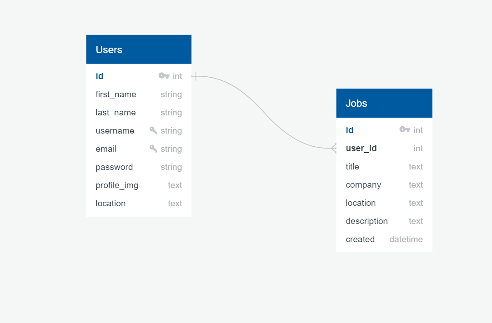

## Description
Job Search Web APP was created to connect users to find a job. In this project user can apply for jobs, save them to favorites, post new jobs and edit them. 

## Features

- access the website as a User
- edit user's profile
- view available jobs on the search page
- save jobs to favorites to apply later
- apply from search page and get redirected to Adzuna website for more information about the job 
- post new jobs
- delete/edit posted 

## Installation

- create virtual environment and activate it

```terminal
$python3 -m venv venv
$source venv/bin/activate
```

- install all requirements

```terminal
$pip install -r requirements.txt
```

- start the app in localhost

```terminal
$flask run
```

## Tests

- to run tests, use respective commands in command line
  
```terminal
$python3 -m test_app.py
$python3 -m test_models.py
```

## API Used
This App was made using the [Adzuna API](https://api.adzuna.com) , which provided all the jobs.

## Heroku Link 
[Job Search APP](https://job-seach-app.herokuapp.com/)

# user Flow
- First in home page click on Signup button for create a new account. If you create the account successfully you can login with a valid username and password and view the search page.

- In the search page insert job title and location on search form to get a list of jobs from API, then you can apply to jobs, also you can save your favorite jobs.

- Click on the username on the navbar, and view the profile page. In this page you can edit the user's profile, post new jobs, view all lists of posted jobs from this user, and view the user's favorite jobs.

- In the Profile page click on the “Post Job” button or click the “Post New Job” menu on the navbar,  the “post new job” page opens. In this page if you enter “Job Title”, “Company Name”, “Location”, “Description” on the form and submit it, a job was created,and back to the profile page.

- In the profile page, section “Posted Jobs” view all lists of posted jobs with current user, also you can edit the job and delete it.

- Click on the “Search Job” menu on the navbar for search desired jobs from API.

- Click on the “Favorite Jobs” menu on the navbar, view all saved jobs, you can apply to your favorite job or delete the job from your favorites list.

## Technologies
- Web/Frontend
  - JavaScript | CSS | HTML
  
- Frontend Libraries/Frameworks
  - Bootstrap | jQuery | Axios | Jinja
  
- Server/Backend
  - Python | SQL | PostgreSQL

- Backend Libraries/Frameworks
  - Flask | Flask-SQLAlchemy


## Database Schema:




	
